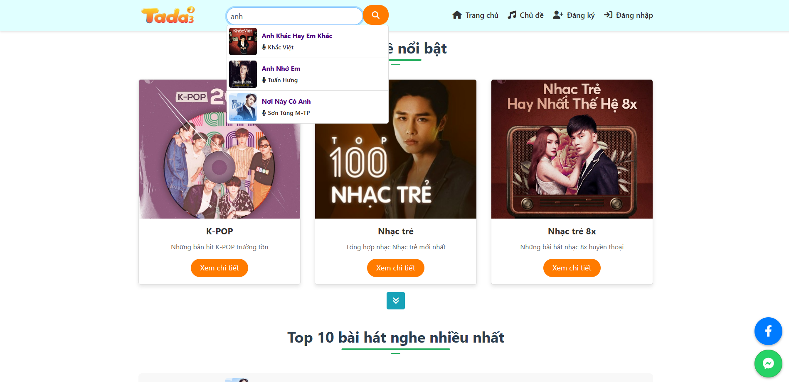
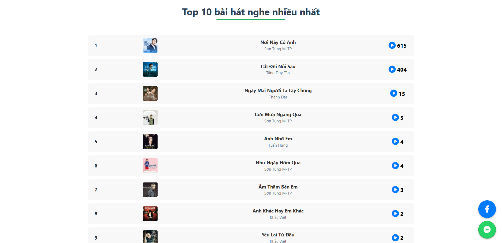
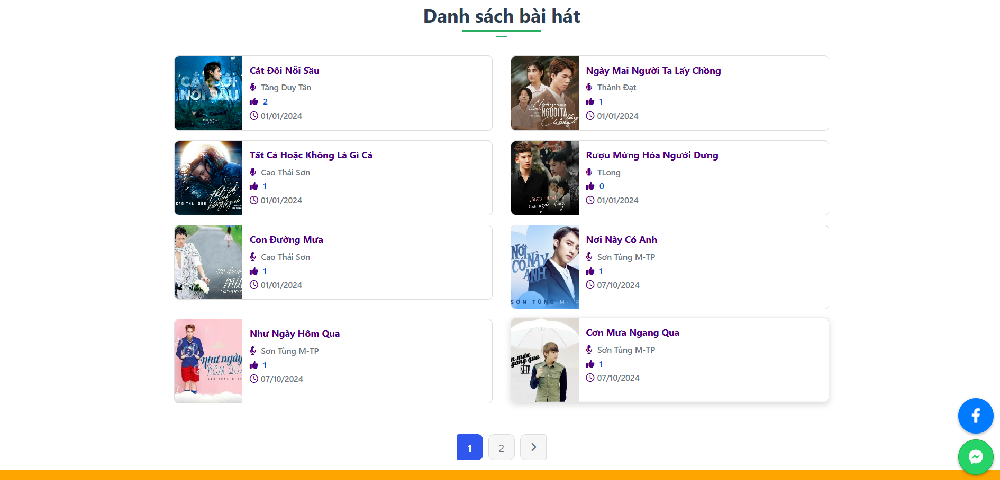
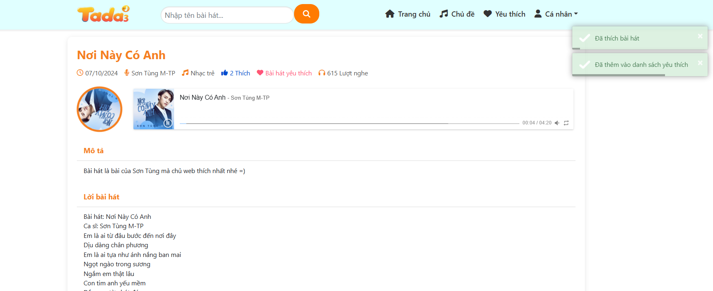
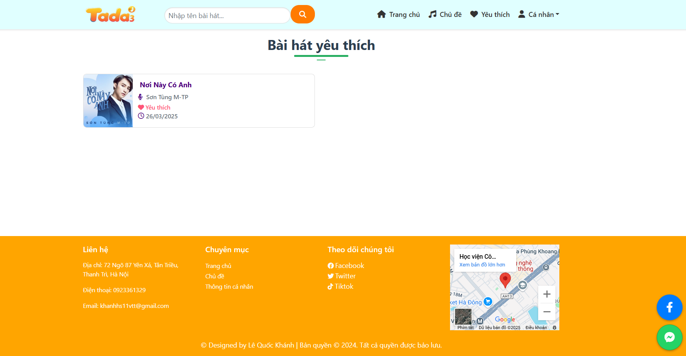
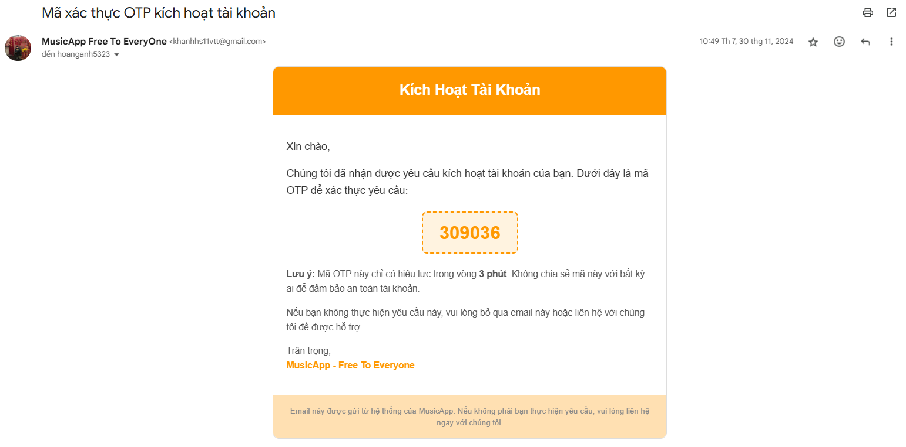
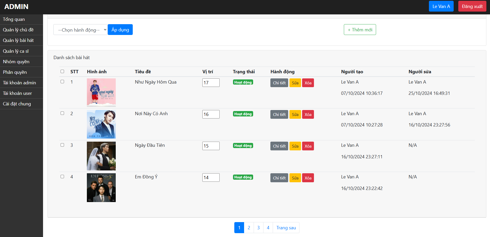
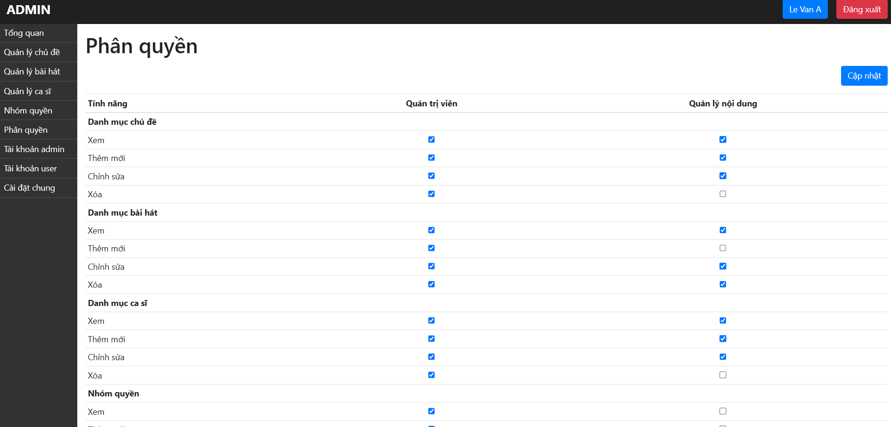

# Music Streaming Website

### Home Page



### Song Ranking Page



### Topic Page



### Song Page with lyrics


### Favorite song and like feature (authenticated)



### Favorite song



### OTP email features using HOTP, TOTP



### OTP sms features using HOTP, TOTP


### Admin Manage Song Interface



### User Access Control Page



## Overview

Music Streaming Website is a feature-rich platform that allows users to stream music, view lyrics, and interact with their favorite songs. It provides authentication via OTP (both email and SMS using HOTP and TOTP), real-time song ranking, topic-based song organization, and an intuitive admin panel for song and user management.

## Technologies

- **Frontend**: Bootstrap, PugJS
- **Backend**: ExpressJS (TypeScript)
- **Database**: MongoDB
- **Cloud Storage**: Cloudinary
- **Authentication**: OTP (HOTP & TOTP via email and SMS)

## Features

### User Authentication

- OTP-based authentication using HOTP & TOTP for enhanced security
- Password recovery via email OTP

### Music Streaming & User Interaction

- Browse and play music in real-time
- View song lyrics directly on the platform
- Like and favorite songs for easy access
- Song ranking system based on user interactions
- Topic-based song categorization

### Admin Dashboard & Management

- Manage songs, artists, and albums
- User access control and role-based permissions
- Track user activity and manage reported content

### Additional Features

- Responsive design for seamless experience on all devices
- Cloudinary integration for efficient song and album cover storage

## Setup and Installation

### Prerequisites

- Node.js and npm installed
- MongoDB (local or Atlas for cloud database)
- Cloudinary account for media storage

### Environment Configuration

1. Clone the repository
2. Create a `.env` file in the root directory with the following variables:
   - Database connection string
   - Cloudinary API credentials
   - OTP configuration for email & SMS

### Running Locally

```bash
# Clone the repository
git clone https://github.com/khanh-ptit/music-app-ts

# Navigate into the project directory
cd music-app-ts

# Create a .env file in the root directory based on .env.example
# Fill in required credentials such as database URL, Cloudinary keys, etc.

# Install dependencies
npm install

# Start the development server
npm start
```

## Live Demo

Check out the live demo at:

```
https://music-app-ts-omega.vercel.app
```
